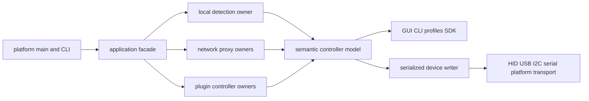

# OpenRGB port grounding

Parity target: upstream commit `8121ee29f46d58f90a56348eb5bf7a64f52f923b`.

This checkout contains 2,347 tracked files, 2,102 C/C++ files, roughly 469,000 native-code lines, 197 controller-family directories, and 224 detector-named C++ source files including platform variants. A full Rust port must preserve observable boundaries rather than mechanically reproduce the class hierarchy.

## Runtime model

- `ResourceManager` coordinates settings, profiles, clients, server, and an aggregate controller view. It does not uniformly own controllers. See `ResourceManager.cpp:919-1015,1172-1319`.
- `DetectionManager` owns local controllers and buses. It applies `Configuration.json` and the active profile before publishing a device. See `DetectionManager.cpp:418-457,657-833,1646-1754`.
- Network clients own `RGBController_Network` proxies. Plugin APIs own plugin-created virtual controllers.
- Consumers must release callbacks and controller handles before an owner removes a controller. Teardown must never join a worker while holding a lock that worker needs.
- Standalone detection and local-client mode intentionally present equivalent detection progress and controller-list behavior.

## Controller model

- Preserve device identity, display metadata, numeric device type, flags, modes, mode flags, speed, brightness, direction, colors, zones, segments, matrices, LEDs, callbacks, update reasons, configuration, and save semantics.
- Preserve stable device-type enum values and keep unknown last.
- Preserve flat LED ordering and exact zone ranges; Rust should use indices/ranges rather than self-referential pointers.
- Whole-device LED/mode writes coalesce on the per-controller worker. Zone, single-LED, zone-mode, and save operations are synchronous upstream. The Rust design must define equivalent externally visible ordering.
- Only device adapters and protocol serializers know wire bytes. UI, CLI, profiles, SDK, and plugins operate on domain commands.
- Side-effect-free detection is a new hardware-safety requirement: finding or opening a device must not write to it.

## Persistence

- `OpenRGB.json`: process settings and runtime-registered schemas.
- `Configuration.json`: manual device names, geometry, and device-specific configuration.
- `profiles/*.json`: lighting snapshots, optional base color, and plugin data.
- Detector names are persisted settings keys.
- Profile matching intentionally ignores HID location and I2C bus number while retaining stable identity fields and I2C address.
- Existing files require compatibility or an explicit, tested migration.

## SDK and plugins

- Preserve OpenRGB SDK protocol versions 0 through 6, the 16-byte `ORGB` header, packet IDs and layouts, the 8 MiB limit, v0 timeout negotiation, v5-and-earlier index addressing, v6 stable IDs and acknowledgements, callbacks, feature flags, and loopback-only local-client privileges.
- The current plugin ABI is Qt/C++ API v5 and returns `QWidget*` and `QMenu*`. It also supports virtual controllers, profile data, settings, tray actions, and SDK commands.
- A pure Rust and egui product cannot load those binaries directly. Preserve plugin capabilities through a Rust-native versioned boundary and treat existing binary-plugin compatibility as an explicit migration problem rather than pretending ABI compatibility.

## Product surfaces and platforms

- One executable supports GUI/tray, CLI actions, standalone hardware control, SDK client/server, headless server, and Windows service modes.
- Preserve schema-driven settings UI, dynamic controller pages, localization/runtime language changes, profiles, manual devices, information views, plugins, rescan/hotplug, autostart, suspend/resume, and service lifecycle.
- Preserve Windows service and power behavior, Linux udev/systemd/tmpfiles and D-Bus behavior, and macOS IOKit/autostart integration.

## Release matrix

- Windows 32/64 portable and 64-bit MSI.
- Linux AppImage and DEB for i386/amd64/armhf/arm64, x86_64 RPM, and amd64/arm64 Flatpak.
- macOS Intel and ARM64 application bundles released as ZIPs.
- Upstream CI only installs packages and runs `--version`; OpenRustyGB needs real domain, codec, migration, UI, and hardware verification before publication.

## HyperX Pulsefire Haste 2

Connected device evidence:

- Product: HyperX Pulsefire Haste 2.
- USB identity: VID `0x03F0`, PID `0x0B97`, revision `0x1111`.
- `MI_00`: mouse input.
- `MI_01`: keyboard, consumer, and system controls.
- `MI_02`: vendor-defined HID; Windows reports usage page `0xFF90`, usage `0xFF00`.

Safety and protocol constraints:

- Exact-match VID/PID/interface 2. Never open the mouse or keyboard/control interfaces for lighting.
- Do not reuse upstream legacy-Haste detection or feature reports. The legacy devices and packets are unrelated, and upstream reports associate that path with DPI corruption.
- Current SignalRGB source for exact PID `0x0B97` uses two 65-byte HID output writes: zero-padded primer `44 01 01`, then zero-padded RGB `44 02 00 00 RR GG BB`.
- Expose one scroll-wheel LED and direct color only.
- The RGB driver must not implement or call the separate `32 01 01` DPI command, firmware, reset, save, profile, polling-rate, lift-off-distance, or unknown reports.
- No automatic write on discovery and no keepalive initially.
- One serialized writer; propagate short writes and transport errors; cancel and join it before dropping the HID handle.
- Live support requires exact-device verification of lighting, pointer movement, buttons, wheel, DPI, polling, reconnect, and teardown behavior.

Primary external evidence:

- OpenRGB issue 4288: `https://gitlab.com/CalcProgrammer1/OpenRGB/-/issues/4288`
- SignalRGB implementation: `https://gitlab.com/signalrgb/signal-plugins/-/raw/Development/Plugins/HyperX/HyperX_Pulsefire_Haste_2_Mouse.js`
